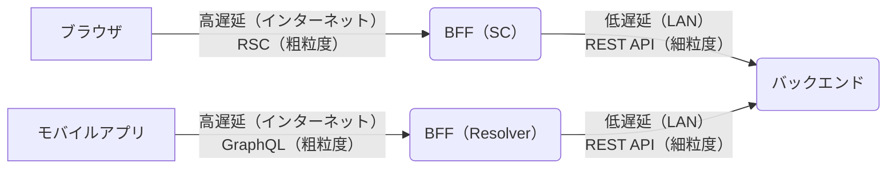

# NextJS の基本的な考え方（App Router)

## データフェッチ

---

データフェッチは**Server Components で実行することが推奨**される

Client Components によるデータフェッチは、下記のデメリットが存在する

- 低速通信下でデータフェッチされるケースが想定されるため通信回数の節約を意識する必要があり API の責務が肥大化しがち
- パフォーマンスを向上するためのキャッシング処理に実装コストがかかる
- 3rd party ライブラリを使用するとバンドルサイズが増加
- ServerSide でフェッチすることと比較して、API 側に堅牢なセキュリティが求められる（パブリックなネットワークに公開するため）

:::caution
ユーザー操作に伴いフェッチデータを再レンダリングしたいケースには ServerComponents は適していない  
AppRouter ではこのケースに対応するために、ServerActions と useActionState フックを使うことで実現する  
ページ全体をレンダリングしなおして問題ないページであれば ServerComponents で router.replace()を利用するシンプルな実装でも問題ない  
:::

## データフェッチ コロケーション

---

AppRouter では**できるだけ末端のコンポーネントへデータフェッチをコロケーションすることが推奨**される

Page コンポーネントでデータフェッチをして下位層のコンポーネントへ渡すことも可能だが、、実装規模が大きくなった時に中間層からのバケツリレーが多くなり設計上デメリットとなる

:::tip
App Router では Request Memoization という機能で同一 URL かつ 同一パラメータのデータフェッチをメモ化する仕組みが存在する  
そのため複数の末端コンポーネントで同一条件のデータフェッチを行うことがデメリットとならない  
ただしオプション指定ミスなどでキャッシュされないミスを防ぐためデータフェッチ層は分離することが推奨される  
:::

またデータフェッチは ServerComponents のみで使用されるべき
ServerComponents で import されることを強制する機能の利用を検討したい

```typescript
import "server-only";
```

## データフェッチ 並列実行

---

データフェッチの結果を基に他のデータフェッチを行うような直列のパターン以外は、並列実行をしてパフォーマンスを向上させる

AppRouter で並列実行をさせる方法

1. 非同期コンポーネントがネストしている（親子関係にある）場合は直列実行される
   そのためデータフェッチ毎にコンポーネントを分割し兄弟関係、兄弟の子孫関係となるように実装する
2. Promise.all()で fetch を並列実行する
3. （最後の手段的なやり方）preload パターンを使用する
   親となるコンポーネント（container 層など）で事前にフェッチ処理を実行しておいて、すべての子孫コンポーネントでは Request Memoization でメモ化した実行結果が利用されるようにする

:::caution
データフェッチ毎のコンポーネント分割をすることで**N+1 問題**が発生しやすくなるため注意

コンポーネントをイテレートしてレンダリングしているような箇所で、そのコンポーネント内でデータフェッチをしているとデータフェッチの回数が膨大となってしまう問題

対策としては下記が挙げられる

- LazyLoading パターン
  短期間の呼び出しをバッチ処理にまとめて一括で処理するパターン
  API 呼び出しのインターフェースを変更することなく N+1 問題に対応することが可能
- EagerLoading パターン
  API 呼び出しで対象となる全てのデータを一括で取得するパターン
  責務が大きくなり密結合となるがパフォーマンスとのトレードオフとして検討の余地あり

:::

## REST API 設計の粒度

---

:::info
ここでいう粒度とは？

一度の API で返却するドメインに関わるデータの粒度を表す

イメージとしては、、、

- ユーザー情報
- ブログ投稿情報

といった場合に、まとめて返すのは粗粒度であり、一つずつ返す API を分割するのは細粒度である
:::

AppRouter は細粒度の RestAPI 設計でもパフォーマンス上の問題とならない（Request Memoization の機能があるため）

汎用性や保守性の観点から、細粒度のシンプルな設計とする事のメリットが大きいため、AppRouter では細粒度の設計とすることが推奨される

GraphQLBFF と RSC は似たような設計思想としている



## Client Components の使い所

---

- onClick()等のイベントハンドラーの利用
- 状態 hooks やライフサイクル hooks の利用
- ブラウザ API の利用
- サードパーティライブラリで RSC 未対応の場合
  このケースは明示的に"use client"を指定した上で re-export する形が良い

ServerComponents はレンダリングされるたびに RSC Payload の転送が行われる  
データ更新が頻繁に行われるとパフォーマンスに問題が起きる場合がある  
そのため繰り返しレンダリングされるコンポーネントは ClientComponents として一度のバンドルされた JavaScript の転送で済むようにした方が良い

ServerComponents 部分はデータフェッチのみとし、ReactElement 部分は ClientComponents とすると良い

```typescript:sample.ts
"use client"

export function SamplePresentational({props}) {
    return (
        <div>{props}</div>
    )
}
```

データ取得を責務とする ServerComponents でこの ClientComponents を import してフェッチしたデータを props で渡す

## Client Components の制約

---

"use client"を定義したコンポーネントが import するコンポーネントは全て ClientComponents として扱われる

上位層で ClientComponents を定義すると、下位層で ServerComponents を含む事が出来なくなるため対策が必要となる

対策として 2 つ方法がある

1. コンポーネントツリーの末端を ClientComponents にする
2. Composition パターンを活用する
   children として ClientComponents に ServerComponents を渡すやり方

ClientComponents は ServerComponents を import することはできない  
"use client"を定義するとクライアントサイドで実行されるため ServerComponents は含めることができない

例外として"use server"が定義された ServerActions となる  
これはユーザー操作に紐づく server 側の処理を ClientComponents へ渡すことができる機能である

## Container/Presentational パターン

---

データ取得とデータ表示の責務でコンポーネント分割を行うパターン

- Container Components
  データ取得して、Presentational へ渡す事に専念する
- Presentational Components
  Container から受け取ったデータを UI へ表示する事に専念する

:::caution
従来の Container/Presentational パターンの文脈は RSC とは少しニュアンスが異なるため注意

従来の文脈

- Container Components
  状態参照と状態変更関数の定義
- Presentational Components
  ReactElement を定義

:::

まずは Page に対して Container 単位で設計を進めると良い

この時点で Composition パターンの適用が必要となるかも合わせて検討していきたい  
これは Presentational の children に他の Container を渡す必要があるか？ということ

Presentational は Container に対する実装詳細と考える事ができる  
このようなモジュールは他の Container から参照されないよう実質的なプライベート定義とした方がよい

:::tip
eslint-plugin-import-access  
このプラグインを使うと同一ディレクトリの外から import を禁止するルールを追加する事が出来る  
:::

## キャッシュの考え方

---

<!-- App Router はデフォルトで Static Rendering となっており、Dynamic Rendering はオプトイン
Static Rendering はレンダリングのタイミングが build 時や revalidate 後となっており、ユーザーリクエスト時の度にレンダリングをする SSR 相当の挙動をさせるためには、fetch のオプションに cache: "no-store"をする必要がある。

page.tsx に下記のように書くやり方でも良い。
export const dynamic = "force-dynamic";

fetch を使っていないサーバーコンポーネントの場合は、下記のように書けばいい
import { connection } from "next/server";
非同期関数内で、await connection();

fetch じゃなくても取得結果をキャッシュできる
unstable_cache()

データがリクエストやユーザーを超えて可変になるようなデータフェッチは Dynamic Rendering で、そうで無いものは Static Rendering とする。
可能な限り Static Rendering を使用することを公式も推奨している。

Server Actions は、サーバーサイドの関数をクライアントサイドで呼び出せる仕組み
実際にはクライアントサイドからサーバーサイドに実行要求されている
処理の終わりに revalidatePath() でキャッシュの更新、redirect()で表示する RSC の更新ができる

Request Memoization は fetch()でメモ化されるが DB アクセスは React.cache()を利用することでメモ化できる

Cookie 操作や、API に対するデータ変更リクエストなど変更操作は Server Actions で行いましょう。(server component ではなくて)

<Suspense>を用いることで、 -->
